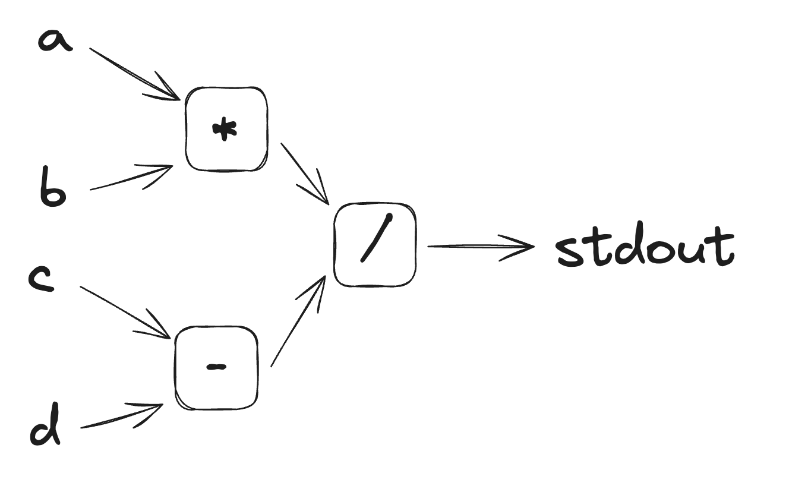
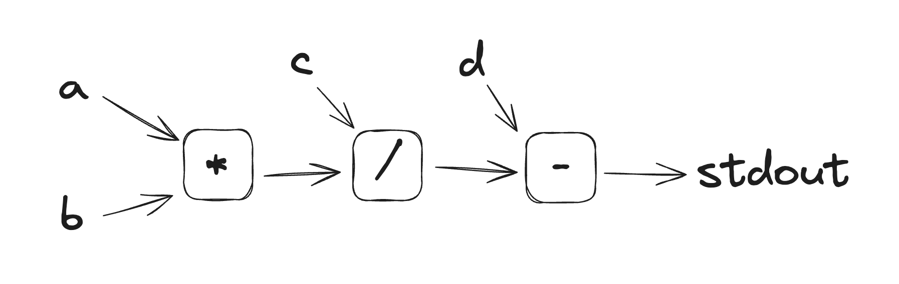
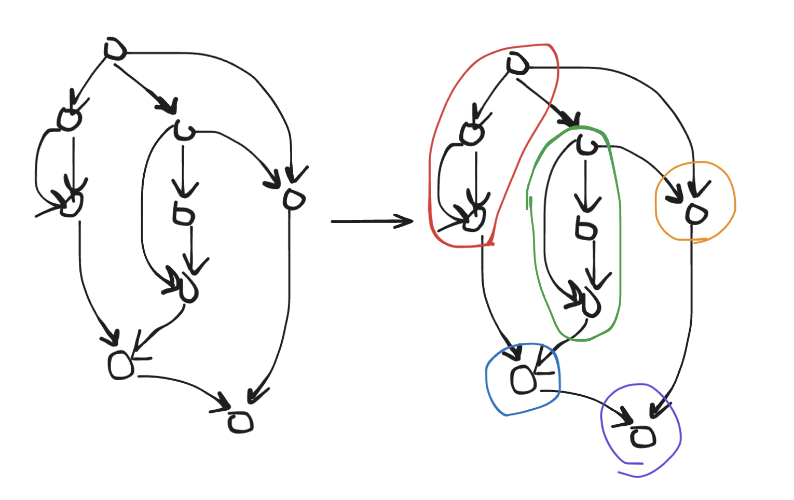

## A New Approach to Automatic Program Parallelization

NOTE: I'm still actively developing the approach described in this article. I will come back to this in the future and fill in the details. For now, I just want to describe the core idea and why I think it might perform better than IC-based systems(like HVM/Bend).

Consider a simple program like this:

```c
void hello(i32 a, i32 b, i32 c, i32 d) {
    print((a * b) / (c - d));
}
```

We can represent this program in Single Static Assignment(SSA) form like so:

```
%1 = mul(%a, %b)
%2 = sub(%c, %d)
%3 = div(%1, %2)
print(%3)
```

This can be drawn as a Directed Acyclic Graph(DAG) like so:



With this visual representation, we can immediately see that the multiplication and subtraction can be run in parallel. The division, however, must happen at the end, since it uses the results of the other operations. To accomplish this, we can use what I call a *task system*. In the program above, the multiplication, subtraction, and division would all be separate tasks. [explain it better].

In C, we might implement a task system like this(some details, like allocation and how the task queue work are skipped for simplicity):

```c

typedef struct {
    Task* task; // The task we're inputting into
    i32* out;
} Output;

typedef struct {
    atomic_u64 inputs_left; // Tracks the number of inputs that are still "unlinked"
    void (*exec)(Task* task);
} Task;

typedef struct {
    Task task;
    i32 a, b;
    Output out;
} MathTask;

typedef struct {
    Task task;
    i32 val;
} PrintTask;

void link_output(Output out, i32 val) {
    *out.out = val;
    atomic_sub(&out.task->inputs_left, 1);
    if(atomic_load(&out.task->inputs_left) == 0) { // All inputs to this task are linked, and we can now execute it
        push_to_task_queue(out.task);
    }
}

void do_mul(MathTask* task) {
    link_output(task->out, task->a * task->b);
    free_task(task);
}

void do_sub(MathTask* task) {
    link_output(task->out, task->a - task->b);
    free_task(task);
}

void do_div(MathTask* task) {
    link_output(task->out, task->a / task->b);
    free_task(task);
}

void do_print(PrintTask* task) {
    printf("%d\n", task->val);
    free_task(task);
}

void hello(i32 a, i32 b, i32 c, i32 d) {
    PrintTask* print = alloc_print_task();
    print->task.inputs_left = 1;

    MathTask* div = alloc_math_task();
    div->task.inputs_left = 2;
    div->out = (Output){print, &print->val};

    MathTask* mul = alloc_math_task();
    mul->a = a;
    mul->b = b;
    mul->out = (Output){div, &print->a};

    MathTask* sub = alloc_math_task();
    mul->a = c;
    mul->b = d;
    mul->out = (Output){div, &print->b};

    push_to_task_queue(mul);
    push_to_task_queue(sub);
}

void run() {
    while(true) {
        Task* task = pop_task_from_queue();
        if(task == NULL) // No more tasks, program is done
            break;
        task->exec(task);
    }
}

int main() {
    hello(1, 2, 3, 4);
    run();
}

```

Note that this can easily be made multi-threaded by having multiple threads taking from the task queue or via task-stealing like in HVM.

While this would achieve maximum theoretical parallelism, there is a lot of overhead for each task. In this case, allocating, deallocating, queueing and dequeueing each task would probably take longer that the computation itself. Of course, this is somewhat unavoidable when parallelizing a program, but ideally we'd minimize this cost. This is especially true for parts of a program that are irreducibly sequential, which pay the cost of this overhead while, by definition, not gaining any speed from parallelization. For instance, consider this program:



Here, no operations can be run in parallel, since each relies on the output of the previous. Therefore, it doesn't make sense to treat them as separate tasks; ideally, we'd create a single bigger task that does this calculation, perhaps implemented like this:

```c
typedef struct {
    Task task; 
    i32 a, b, c, d;
    Output out;
} BigMathTask;

void do_big_math_task(BigMathTask* task) {
    link_output(task->out, task->d - (task->c / (task->a * task->b)));
    free_task(task);
}
```

This is the core idea behind the experimental parallelizing compiler backend I'm working on right now: take a DAG representing a program in SSA form, identify the irreducibly sequential parts using [insert graph theory algorithm here], and compile it to tasks that will do the equivalent computation as efficiently as possible. 



This diagram shows how a DAG might be partitioned into tasks. I'm still working out how exactly this "task partitioning" algorithm will work.

`TODO: exlain how branching, looping, recursion, etc will work. TL;DR, we spawn new tasks and link them up to the correct outputs.`

The reason I think this approach will be faster than Interaction Combinator VMs is that they currently have no way to do sequential computation(which is inevitable to a degree) efficiently. Each step in a sequential algorithm has a lot of overhead from queueing redexes, allocating and deallocating node pairs, etc. This means sequential algorithms running on HVM will always be many times slower than the same algorithms compiled to machine code, just like how code running on a bytecode VM will always be slower than the equivalent machine code. Since performance is, to an extent[1], the whole appeal of maximally parallelizing programs, I think this is a big problem with the Interaction Net approach. 

With aggressive optimiziations and inlining, I believe my approach will be able to compile sequential algorithms like binary search directly to machine code with no runtime overhead, as if it was written in C(in fact, my current plan is to compile to C for simplicity). However, my approach still retains the promise of theoretically maximum parallelism.

There are still a lot of things I need to work out to put this idea into practice(how will tasks be allocated/deallocated/queued? how will garbage collection work? FFI? can this be compiled for GPUs efficiently?), but I think that this is a promising approach to automatic program parallelization. 


[1] As I see it, the main value is not performance per se, but that we can easily improve performance by throwing more cores at the problem. I think automatic program parallelization is exciting because it could be a way to bring Moore's law back from the dead; if we write programs that take advantage of something like HVM today, they will magically become 1000x faster when NVidia announces a new million-core GPU in a few years. 
